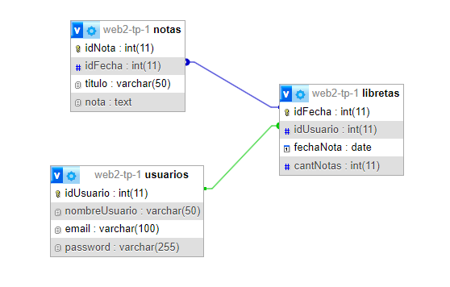

# Base de datos para un bloc de notas

## Desarrolladores: 
* Nombre: Joel Fuentes 
    * Email: fuenteslautarojoe@gmail.com
* Nombre: Martín Lorenzi
    * Email: alexmartin9c@gmail.com 

**El objetivo de este proyecto es desarrollar una base de datos para una aplicación de notas. La aplicación permite a los usuarios realizar las siguientes acciones:**

1. **Registro de usuario: Los usuarios pueden registrarse en el sitio y obtener una libreta de notas.**
2. **Gestión de notas: Con esta libreta los usuarios pueden crear, solicitar, modificar, o eliminar sus notas.**
3. **Identificación de notas: Las notas de cada usuario son identificadas por fechas, lo que permite su futura consulta o modificación.**

#### diagrama de relacion entre tablas: 

**En el siguiente “diagrama de relación”, se puede observar cómo las tres tablas están relacionadas mutuamente formando una estructura de datos jerárquica que facilita la modificación y consulta de los datos almacenados. En esta estructura jerárquica, cada tabla utiliza una “clave primaria” en uno de sus campos para identificar de manera única cada registro, evitando duplicados y asegurando la integridad de sus datos. Esto permite que otra tabla utilice una “clave foránea” en uno de sus campos para realizar una referencia a la clave primaria de la tabla con la que se quiera relacionar, asegurando de esta forma que los registros de ambos campos sean idénticos y mantengan una coherencia entre tablas.**

**Por lo tanto para el desarrollo de esta propuesta se considera que:**

1. **Un usuario posee una libreta con notas.**
2. **Las notas del usuario se agrupan por fechas (por lo tanto una misma fecha puede contener varias notas).**
3. **Las notas de cada fecha se componen de un título y de un texto.**

**Estas relaciones y propiedades quedan expuestas en el “diagrama de relación” donde la tabla “usuarios” es la encargada de almacenar los datos de cada usuario del sitio y conectarse mediante el campo “idUsuario” con la tabla “libretas”, encargada de almacenar el número total de notas del usuario y las fechas de su creación. Por otro lado, la tabla “libretas” mediante el campo “idFecha” se relaciona con la tabla “notas” encargada de almacenar el contenido de cada nota y su título correspondiente.** 

